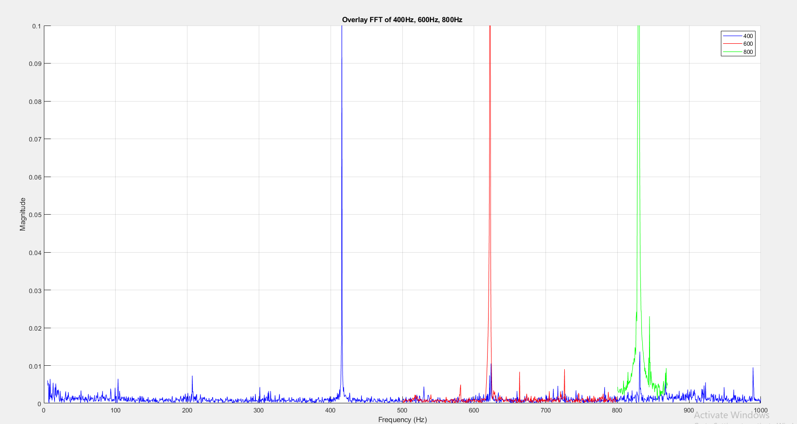

# Smart Spindle Health Monitoring System
**A dual-approach spindle health monitoring solution — combining industrial-grade NI CompactRIO + LabVIEW control with a cost-effective Raspberry Pi platform for real-time vibration-based fault detection and predictive maintenance.**

---

## 📌 Overview
Modern CNC spindles are critical to manufacturing precision, yet prone to faults like imbalance, misalignment, and bearing wear.  
This project presents **two complementary approaches** to spindle health monitoring:

1. **Industrial-Grade Setup** — **NI CompactRIO + LabVIEW** with FPGA and RT modules for multi-channel, high-frequency data acquisition and real-time fault detection.
2. **Low-Cost Setup** — **Raspberry Pi + MCP3208 ADC** with custom IEPE signal conditioning and Python-based analysis for budget-friendly, single-channel diagnostics.

**Core Capabilities:**
- **Real-time FFT analysis** for frequency-domain fault detection.
- **Thermal warm-up cycle** before acquisition to ensure stable readings.
- **Automated triggering** at specific spindle speeds to reduce unnecessary data storage.
- **Adaptable design** for both high-end industrial use and cost-sensitive environments.

---

## 🖥 LabVIEW System Interface

### 🖥 Using the LabVIEW User Interface

The **LabVIEW-based user interface** provides complete control and live monitoring of the spindle health monitoring system.

#### Main Functions
- **Start Warm-Up Cycle** → Runs a predefined spindle warm-up routine to thermally stabilize the system before measurements.
- **Set Spindle Speed** → Input the desired spindle RPM for testing.
- **Start Measurement** → Begins vibration data acquisition and real-time FFT analysis.
- **Direction Control** → Switch between forward and reverse spindle rotation.
- **Log Data** → Save captured data in `.tdms` format for offline analysis.

#### Live Displays
- **Time-Domain Graph** → Shows real-time acceleration vs. time.
- **Frequency Spectrum Graph (FFT)** → Displays live frequency-domain data to identify vibration peaks.
- **System Status Indicators** → Show spindle state, connection status, and active mode.
- **Data Logging Status** → Confirms whether the system is currently storing vibration data.

#### Workflow
1. **Power on** the CompactRIO system and connect it to the PC running LabVIEW.
2. **Select the desired spindle speed** in the interface.
3. **Run the warm-up cycle** to stabilize the spindle.
4. **Start measurement** to capture acceleration data and monitor the FFT plot in real time.
5. **Save results** for later diagnostic analysis.

---

## 🔧 System Architecture

### PC VI – Host Application
The **PC VI** manages the user interface, system control, and data logging.  
It sends configuration commands to the FPGA, displays **real-time time-domain and frequency-domain graphs**, and stores measurement data for offline analysis.

### FPGA VI – Real-Time Processing
The **FPGA VI** handles **deterministic high-speed data acquisition** from the IEPE accelerometer, applies initial signal conditioning, and executes automated triggering for warm-up and measurement cycles.  
This ensures precise timing and reliable operation even under high spindle speeds.

 

**LabVIEW FPGA Block Diagram**  

**LabVIEW PC Control Block Diagram**  

---

## 📡 Hardware Setup

**Raspberry Pi + Arduino Schematic**  

### Raspberry Pi–Based Cost-Effective Setup

The Raspberry Pi–based system provides a **low-cost alternative** to industrial-grade spindle health monitoring, while maintaining accurate frequency detection for predictive maintenance.

#### 📦 Hardware Components
- **Raspberry Pi 4 Model B** → Data acquisition & processing
- **MCP3208 12-bit ADC** → Analog-to-digital conversion
- **IEPE Accelerometer** → Vibration sensing
- **Custom IEPE Signal Conditioning Circuit**:
  - LM317 constant current source (4 mA excitation)
  - AC coupling capacitor to remove DC bias
  - TL072 op-amp buffer stage
- **Arduino UNO** → Trigger signal generation for spindle motor
- **MCP4725 DAC** → Converts digital trigger values to analog voltage
- **Op-amp driver** → Amplifies DAC output to required spindle control voltage
- **Breadboard, Jumper Wires, and Power Supply**

---

#### ⚙️ Working Principle
1. **Vibration Sensing**  
   The IEPE accelerometer captures spindle vibration and sends an analog voltage signal to the signal conditioning circuit.  
   - LM317 supplies constant current to the IEPE sensor.  
   - AC coupling removes DC bias.  
   - TL072 op-amp buffers and conditions the signal for ADC conversion.

2. **Data Acquisition**  
   The MCP3208 ADC samples the conditioned vibration signal and sends digital data to the Raspberry Pi over SPI.

3. **Data Processing**  
   A Python script on the Pi:
   - Performs **real-time logging** to CSV.
   - Computes **FFT** to extract dominant vibration frequencies.
   - Triggers data capture automatically at specific spindle speeds.

4. **Automated Triggering via Arduino + DAC**  
   - The Raspberry Pi sends the **desired spindle frequency** to the Arduino.  
   - The Arduino calculates the corresponding **control voltage** needed by the spindle drive.  
   - This value is sent to the MCP4725 DAC, which outputs an analog voltage.  
   - An op-amp amplifies the DAC output to match the spindle control input requirements.  
   - This mechanism ensures **automated spindle speed setting**, eliminating manual adjustments.

---

#### ✅ Advantages
- **Low Cost** — Fraction of CompactRIO price.
- **Accurate** — Matches industrial system’s dominant frequency peaks.
- **Automated Control** — Spindle speed set directly from Raspberry Pi interface.
- **Portable** — Can be deployed to multiple machines easily.

---

## 🛠 Circuit Diagram & Schematic

**LabVIEW CompactRIO Wiring Diagram** *(PDF in repo)*  
📄 [`schematics/LabVIEW_cRIO.pdf`](schematics/LabVIEW_cRIO.pdf)  

**Raspberry Pi Circuit Diagram** *(PDF in repo)*  
📄 [`schematics/RaspberryPi_Arduino.pdf`](schematics/RaspberryPi_Arduino.pdf)

---

## 📊 Results Showcase

### 📈 Signal Analysis Results

**Spindle Vibration Signal**  

**Frequency Spectrum Example**  

#### 📈 Acceleration Response & Frequency Spectrum at Multiple Speeds

The spindle health monitoring system was tested at **three operating speeds** corresponding to vibration frequencies of **200 Hz**, **300 Hz**, and **400 Hz**.

##### ⏱ Time-Series Acceleration Plot
- Displays the measured acceleration over time for each operating speed.
- Waveforms show **clear periodic patterns** whose frequency increases proportionally with spindle speed.
- **Stable amplitude envelopes** indicate consistent running conditions without sudden transients.

##### 📊 Frequency Spectrum Plot (FFT)
- For each speed, the FFT reveals a **dominant peak at twice the rotational frequency** (*second harmonic*), a characteristic indicator of **axial misalignment**.
- **Secondary peaks** and harmonic content suggest the possibility of **combined faults** such as looseness or coupling issues.

### ⚖️ Benchmarking High Precision LabVIEW setup with Compact & Cost-effective setup

**The benchmarking test using a 159 Hz Calibrometer** demonstrated that both the CompactRIO + LabVIEW system and the Raspberry Pi cost-effective setup captured the dominant vibration frequency with remarkable consistency.
In both cases, the frequency spectrum exhibited a clear, sharp peak at 159 Hz, validating the accuracy of the low-cost solution in frequency-domain analysis.

While the CompactRIO system delivered lower noise levels, higher sampling rates, and multi-channel capability, the Raspberry Pi implementation provided comparable frequency detection performance at a fraction of the cost.
These results confirm that the Raspberry Pi–based system is a reliable alternative for applications where budget and portability are key considerations, without sacrificing core diagnostic accuracy.

The experimental results from both the CompactRIO + LabVIEW setup and the Raspberry Pi cost-effective system show a high degree of agreement in detecting dominant vibration frequencies. The frequency spectrum peaks are consistent across both platforms, confirming that the low-cost setup can achieve accurate frequency detection comparable to the industrial-grade system.

**Calibrometer Output – LabVIEW**  

**Calibrometer Output – Low-cost System**  

---

## ⚖️ Detailed System Comparison

| Parameter | CompactRIO (LabVIEW) | Raspberry Pi |
|-----------|----------------------|--------------|
| **Data Acquisition Hardware** | NI CompactRIO 9040 with NI 9234 (IEPE vibration), NI 9263 (analog output), NI 9375 (digital I/O) | Raspberry Pi with MCP3208 10-bit ADC |
| **Sampling Rate** | Up to 51.2 kS/s per channel (multi-channel) | ~25.6 kS/s (single channel) |
| **Number of Channels** | Multi-channel (expandable via NI C-Series modules) | Single-channel per ADC (multiple MCP3208 chips possible) |
| **Signal Conditioning** | Direct IEPE sensor interface via NI 9234 with built-in current excitation | LM317-based constant current source, AC coupling, TL072 op-amp buffer |
| **Processing** | FPGA-based real-time data handling + RT processor FFT analysis | Python-based FFT and threshold detection |
| **Triggering** | FPGA-controlled, speed-specific automated data logging | Software-based amplitude threshold triggering |
| **Thermal Warm-Up** | Automated spindle warm-up sequence before acquisition | Automated spindle warm-up sequence before acquisition |
| **Accuracy** | High precision, low noise, industrial-grade | Good accuracy for general monitoring; slightly more noise than CompactRIO |
| **Scalability** | Supports multiple sensors and control outputs | Easily scalable by adding low-cost boards |
| **Cost** | High (industrial hardware) | Low (educational budget) |
| **Ideal Use Case** | Industrial CNCs, high-precision research | Educational, small workshops, distributed low-cost monitoring |

---

## 👨‍🏫 Acknowledgements
- **Indian Institute of Technology Kanpur**
- **Mentor:** Dr. Mohit Subhash Law

---

👥 **Contributors:** *Humayun Ahmad*, *Chanda Bhavitha Sri*, *Jainam Tated*
